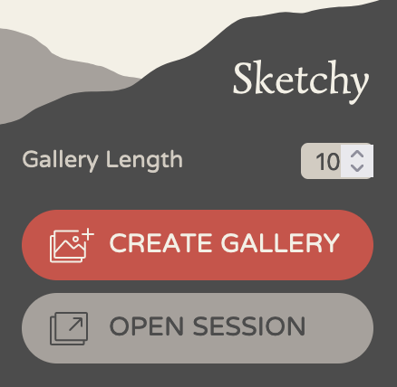
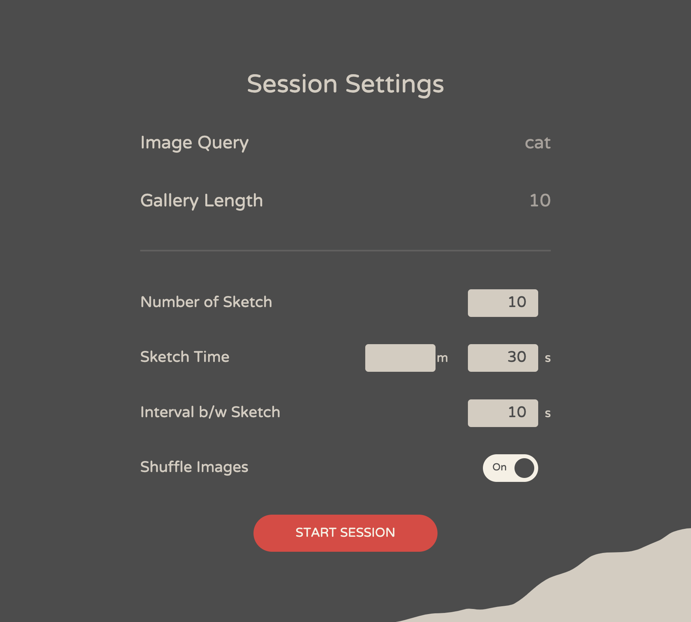

# Sketchy
SketchyはGoogle画像検索の結果からドローイングの練習のためのスライドショーを実行できるブラウザ拡張機能です.
**Sketchyはまだアルファ版の段階であるため、バグや問題が含まれている可能性があります**。Sketchyは[MITライセンス](https://mit-license.org/)でリリースされており、**利用に伴って起こった問題について開発者は一切責任を負いません。当ソフトウェアの利用は自身の責任と判断で行ってください**。また、バグに遭遇した場合は[issues](https://github.com/ktoshima/sketchy/issues)までご報告ください。

## インストール方法
### ビルド済みのパッケージを読み込む
Sketchyはまだalpha版の段階でブラウザ拡張機能のプラットフォームには公開していないので、現時点ではこの方法が一番簡単です。
1. 最新版のリリースを[releases](https://github.com/ktoshima/sketchy/releases)からダウンロードし、解凍する。
2. 各ブラウザの「ローカルファイルから拡張機能を読み込む」機能を使って、解凍した拡張機能を読み込む。
	- 現在、Firefoxのみがサポートされています。 Firefoxでのインストール方法は[ここ](https://developer.mozilla.org/en-US/docs/Mozilla/Add-ons/WebExtensions/Your_first_WebExtension#installing)を参照。
	- Google ChromeとSafariの追加サポートを将来のリリースで予定しています。
### 自分でビルドする
あるいは、自分でビルドすることもできます。このリポジトリをローカルにクローンした後、以下の手順に従ってください;
1. [Node.js](https://nodejs.org/ "nodejs.org")をインストールし、以下のコマンドを実行:
```bash
npm install
```
2. 上記が終わったあと、下のコマンドを実行すると、Sketchyに必要なすべてのファイルを含む`dist`フォルダが作成されます。Sketchyの大部分は[React](https://react.dev/ "react.dev")で書かれており、[webpack](https://webpack.js.org/ "webpack.js.org")を使ってコンパイルされています。ビルドコマンドは`package.json`、ビルド設定は`webpack.config.js`に記述されているので、設定をいじりたい場合はそちらを参照してください。
```bash
npm run build:prod
```

3. `dist`フォルダを選択して拡張機能を読み込む。拡張機能をローカルファイルからブラウザに読み込む方法については、前のセクションを参照してください。

## How to use
1. google.comに行き、キーワードで検索し、画像タブを開く (現在、SketchyはGoogle画像検索にのみ対応しています)。
2. ツールバーをクリックして、Sketchyを開く (必要に応じてツールバーにSketchyをピン留めしておく)。
3. 下のような画面が表示されます。スライドショーのセッションを始める前に、まず、検索結果からGallery (画像のリスト) を作成する必要があります。これを行うには、Gallery Lengthを設定し、"CREATE GALLERY "ボタンをクリックします。

	

	- Gallery Lengthは、検索結果からGalleryに読み込みたい画像の数で、デフォルト値は10、最大値は50です。**Gallery Lengthの数値が大きいほど、Galleryを作成するのに時間がかかります**。また、長いギャラリーを作成する場合、Gallery Lengthで設定した数の画像が検索結果に読み込まれている必要があるため、検索結果をスクロールダウンして検索結果の画像を読み込ませてください。
4. Galleryの作成に成功すると、"OPEN SESSION"ボタンがアクティブになります。クリックしてスライドショーセッション用の新しいタブを開きましょう。
5. 新しく開いたタブは以下のようになります。ここでセッションを開始する前にスライドショーの設定を変更することができます。設定後、"START SESSION"をクリックしてセッションを開始します。

	

	- Number of Sketch: 描きたいスケッチの枚数を設定します。ここで設定したスケッチ数を完了するか、ギャラリーの画像を一巡するとセッションは終了します。
	- Sketch Time: 各画像が表示される時間を設定します。1m 30sと入力しても90sと入力しても同じように90秒で設定されます。
	- Interval: 各スケッチ間のインターバルの秒数を設定します。
	- Shuffle Images: Gallery内の画像の表示順をランダムにするかどうかを切り替えます。

6. "START SESSION"をクリックすると、5秒間の準備時間のあとスライドショーが開始されます。セッション画面は以下のようになっています。

	

	1. Timer: 残り秒数を表示します。残り5秒を切ると赤くなります。
	2. Play/Pause: タイマーの再生/一時停止を切り替えます。
	3. Skip: 現在の画像/インターバルをスキップします。スケッチ中にスキップした場合、スケッチカウントは増えません。
	4. Sketch No.: 現在描いているスケッチのカウントを表示します。インターバル中は表示されません。
	5. Image: ここに画像が表示されます。インターバル中は表示されません。

7. スケッチのカウントが最初に設定したスケッチ数に達するか、ギャラリーの画像を一巡すると、セッション終了を知らせるメッセージが表示されます。終了後はそのタブを閉じればSketchyが終了されます。また、途中でセッションを終了したい場合、タブを閉じれば、いつでもセッションを終了することができます。
