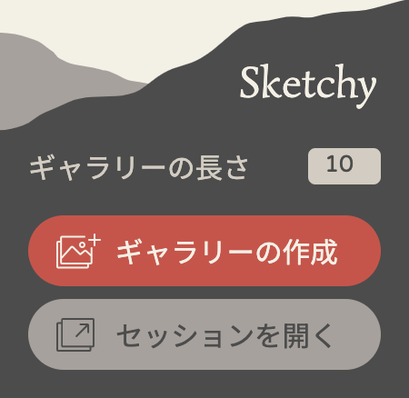
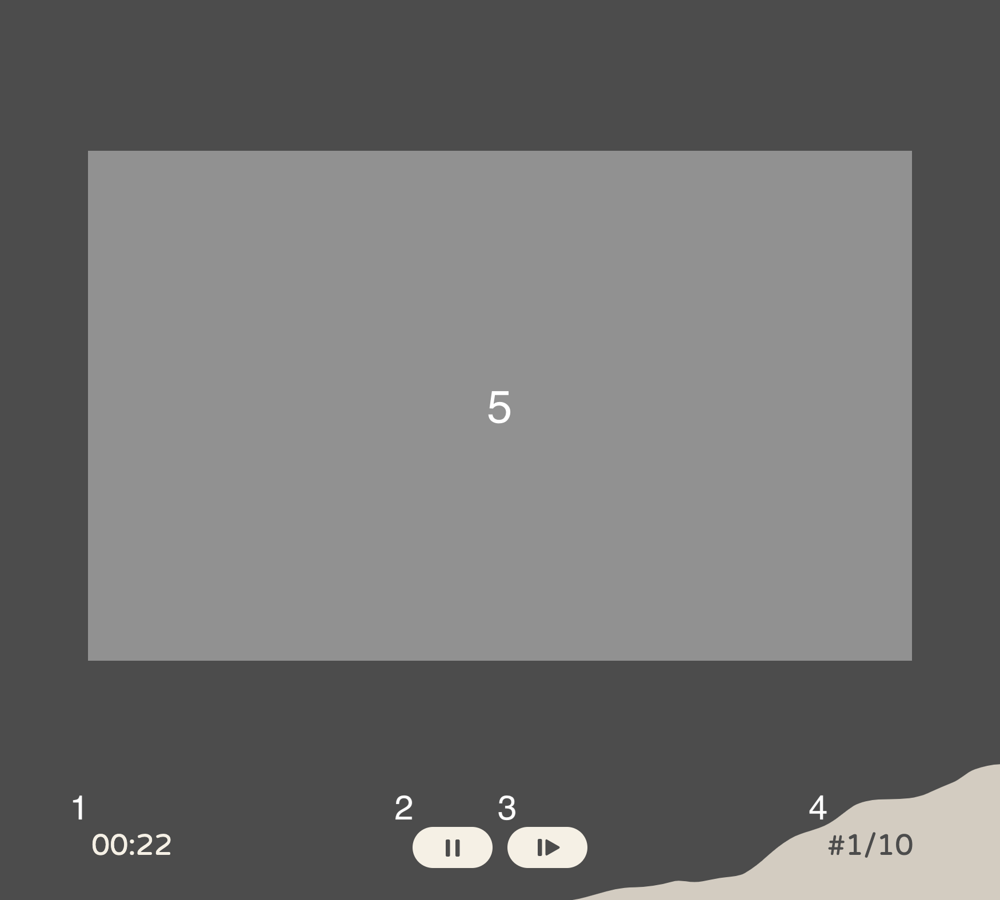

# Sketchy
SketchyはGoogle画像検索の結果からドローイングの練習のためのスライドショーを実行できるブラウザ拡張機能です.
**Sketchyはまだプレリリースの段階であるため、バグや問題が含まれている可能性があります**。Sketchyは[MITライセンス](https://mit-license.org/)でリリースされており、**利用に伴って起こった問題について開発者は一切責任を負いません。当ソフトウェアの利用は自身の責任と判断で行ってください**。また、バグに遭遇した場合は[issues](https://github.com/ktoshima/sketchy/issues)までご報告ください。

## インストール方法
### ビルド済みのパッケージを読み込む
Sketchyはまだブラウザ拡張機能のプラットフォームには公開されていないので、現時点ではこの方法が一番簡単です。
1. 最新版のリリースを[releases](https://github.com/ktoshima/sketchy/releases)からダウンロードし、解凍する。
2. 各ブラウザの「ローカルファイルから拡張機能を読み込む」機能を使って、解凍した拡張機能を読み込む。Sketchyは現在、Google ChromeとFirefoxでサポートされています。
	- Google Chromeでのインストール方法は[ここ](https://developer.chrome.com/docs/extensions/get-started/tutorial/hello-world#load-unpacked)を参照。
	- Firefoxでのインストール方法は[ここ](https://developer.mozilla.org/en-US/docs/Mozilla/Add-ons/WebExtensions/Your_first_WebExtension#installing)を参照。
	- Safariでの追加サポートを将来のリリースで予定しています。
### 自分でビルドする
あるいは、自分でビルドすることもできます。このリポジトリをローカルにクローンした後、以下の手順に従ってください;
1. [Node.js](https://nodejs.org/ "nodejs.org")をインストールし、レポジトリ内 (`package.json`があるフォルダ) で以下のコマンドを実行:
```bash
npm install
```
2. 上記の実行後、下のコマンドを実行すると、Sketchyに必要なすべてのファイルを含む`dist/{ブラウザ名}`フォルダが作成されます。
```bash
# Google Chrome向け
npm run build:prod:chrome
# Firefox向け
npm run build:prod:firefox
```

3. `dist/{ブラウザ名}`フォルダを選択して拡張機能を読み込む。拡張機能をローカルファイルからブラウザに読み込む方法については、前のセクションを参照してください。

## 使用方法
1. google.comに行き、キーワードで検索し、画像タブを開く (現在、SketchyはGoogle画像検索にのみ対応しています)。
2. ツールバーをクリックして、Sketchyを開く (必要に応じてツールバーにSketchyをピン留めしておく)。
3. 下のような画面が表示されます。スライドショーのセッションを始める前に、まず、検索結果からギャラリー (スライドショーで表示される画像のリスト) を作成する必要があります。これを行うには、ギャラリーの長さを設定し、"ギャラリーを作成"ボタンをクリックします。

	

	- ギャラリーの長さは、検索結果からギャラリーに読み込む画像の数で、デフォルト値は10、最大値は50です。**ギャラリーの長さが大きいほど、ギャラリーの作成に時間がかかります**。また、ギャラリーの長さで設定した数の画像が検索結果に読み込まれていないとギャラリーが正しく作成されないため、長いギャラリーを作成する場合は検索結果をスクロールダウンして検索結果の画像を読み込ませてください。
4. ギャラリーの作成に成功すると、"セッションを開く"のボタンがアクティブになります。クリックしてスライドショーセッション用の新しいタブを開きましょう。
5. 新しく開いたタブは以下のようになっています。ここでセッションを開始する前にスライドショーの設定を変更することができます。設定後、"セッションを開始する"ボタンをクリックしてセッションを開始します。

	

	- スケッチ数: 描きたいスケッチの枚数を設定します。ここで設定したスケッチ数を完了するか、ギャラリーの画像を一巡するとセッションは終了します。
	- スケッチの時間: 各画像が表示される時間を設定します。1分30秒と入力しても0分90秒と入力しても同じように90秒で設定されます。
	- スケッチ感のインターバル: 各スケッチ間のインターバルの秒数を設定します。
	- 画像の順番をシャッフル: ギャラリーの画像の表示順をランダムにするかどうかを切り替えます。

6. "セッションを開始する"をクリックすると、5秒間の準備時間のあとスライドショーが開始されます。セッション画面は以下のようになっています。

	

	1. タイマー: 残り秒数を表示します。残り5秒を切ると赤くなります。
	2. 再生/一時停止: タイマーの再生/一時停止を切り替えます。
	3. スキップ: 現在の画像/インターバルをスキップします。スケッチ中にスキップした場合、スケッチカウントは増えません。
	4. スケッチナンバー: 現在描いているスケッチのカウントを表示します。インターバル中は表示されません。
	5. 画像: ここに画像が表示されます。インターバル中は表示されません。

7. スケッチのカウントが最初に設定したスケッチ数に達するか、ギャラリーの画像を一巡すると、セッション終了を知らせるメッセージが表示されます。終了後はそのタブを閉じればSketchyが終了されます。またセッションの途中でもタブを閉じれば、いつでもセッションを終了することができます。
