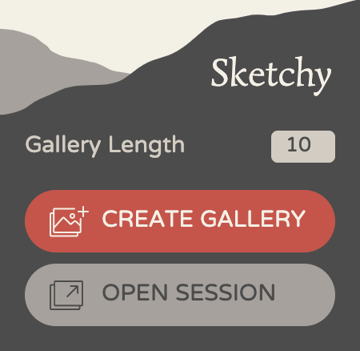
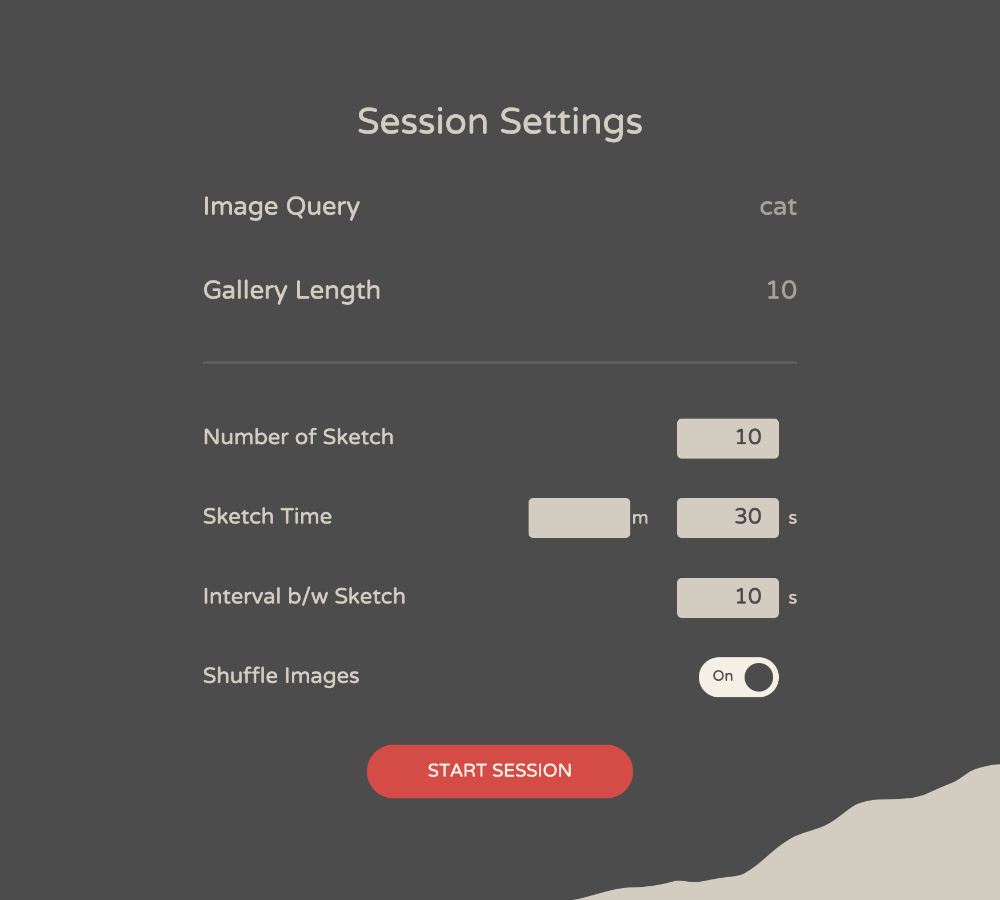

# Sketchy
Sketchy is a simple, light, and fast browser extension that allows you to setup a slideshow from Google Image Search result for your drawing session.  
Note that **Sketchy is still at its alpha stage, and thus likely to contain bugs and issues**. Sketchy is released under MIT license, so **use at your own discretion** and if you encounter any bugs please report to [issues](https://github.com/ktoshima/sketchy/issues).

For Japanese readme, refer to README-jp.md. 日本語の説明はREADME-jp.mdを参照のこと.
## How to install
### Load built package
We are still working on publishing Sketchy on extension platforms. Currently this is the easiest way to install Sketchy to your browser.
1. Download and unzip the latest release from [releases](https://github.com/ktoshima/sketchy/releases) for your browser of choice.
2. Use your browser's "load extension from local file" feature to load the extracted extension. Currently only Firefox is supported. Additional support for Google Chrome and Safari is planned for future releases.
	- For Firefox, see [here](https://developer.mozilla.org/en-US/docs/Mozilla/Add-ons/WebExtensions/Your_first_WebExtension#installing).
### Build yourself
Alternatively, you can build the extension yourself. Follow the instrutions after cloning this repo to your local machine;
1. Install [Node.js](https://nodejs.org/ "nodejs.org"), then run:
```bash
npm install
```
2. Run the following and it will create `dist` folder, which includes all files necessary for Sketchy. Sketchy is largely written in [React](https://react.dev/ "react.dev") and compiled using [webpack](https://webpack.js.org/ "webpack.js.org"). Build command is written in `package.json` and build configuration is written in `webpack.config.js`, so you can tweak parameters in those files.
```bash
npm run build:prod
```

3. Load extension from local file by choosing `dist` folder. Refer to the previous section on how to load extension from local files to your browser.

## How to use
1. Go to google.com, search with your keyword, and open the image tab. Currently Sketchy is only compatible with Google Image Search.
2. Open Sketchy by clicking on the toolbar. You might want to pin it on your toolbar here.
3. You will see something like below. Before starting a slideshow session, first you need to create a gallery (list of images) from your search result. To do that, set gallery length and click on "CREATE GALLERY" button.

	

	- Gallery length is the number of images you want to load into your gallery from your search result, of which the default value is 10 and max is 50. Note that **the larger the gallery length is, the longer it takes to create gallery**. Also, you might want to scroll down your search result before creating a large gallery to make sure that the number of images you set for gallery length is loaded in your search result.
4. After successfully creating a gallery, "OPEN SESSION" button will become active. Click on it to open up a new tab for slideshow session.
5. The newly opened tab will look like below. Here you can change settings of the slideshow before starting a session. After configuration, you can click on "START SESSION" to start a session.

	

	- Number of Sketch: set number of sketch you want to draw. The session will end once you complete the number of sketch you set here or the gallery runs out.
	- Sketch Time: set how long each image will be shown for drawing. You can set 1 minute 30 seconds or 90 seconds, either will work.
	- Interval: set how long you want to take a break between each sketch.
	- Shuffle Images: toggle whether to randomize the order in which the images in the gallery are displayed.

6. The session will start with a five-second interval to give you a time to prepare. The session will look like below.

	

	1. Timer: show how many seconds are left. Will turn red when less than five seconds is left.
	2. Play/Pause: toggle play/pause of timer.
	3. Skip: skip current image. This will not increase the sketch no.
	4. Sketch No.: shows number of sketch you are drawing right now. Not displayed during interval.
	5. Image: image is shown here. Not displayed during interval.

7. After completing the number of sketch you set initially or running out of images in the gallery, a message informs you that the session is over. You can close the tab and call it a day. Also note that you can exit the session whenever you want by closing the tab.
